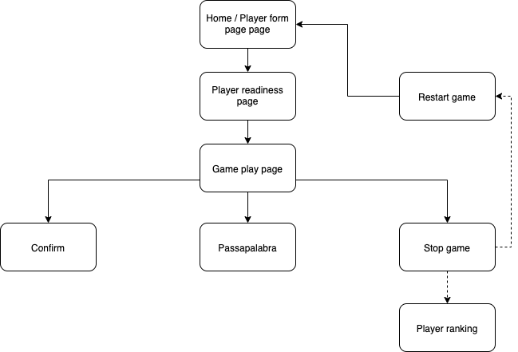

# Introduction
[Pasapalabra](https://en.wikipedia.org/wiki/Pasapalabra) is a Spanish television game show, adapted from the British format The Alphabet Game.

## Functional Description
The game consists of guessing the twenty-five words, each of which corresponds to a letter of the thread for which a definition relative to a physical concept is offered. Successes will be reflected in the letters by the color green, while the incorrect ones will be shown in red. Unanswered questions or "passapalabra" will be shown in blue.
### Use Cases

## Technical Description
### Blocks

### Components

### Data Model
```js
var questions = {
    en: [
        [
            { letter: string, answer: string | array, status: int<0,1,2,3>, question: string },
            ...
        ]
    ],
    es: [...]
    ...
}
```