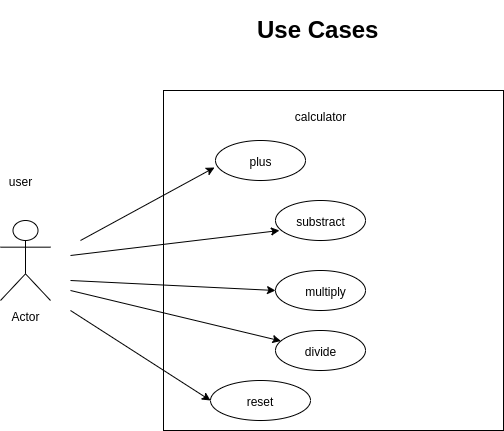
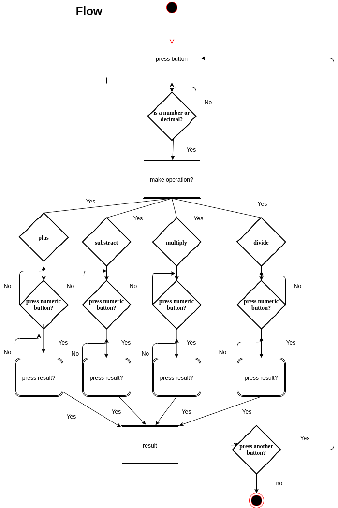

# Introduction
this introduction is to explain one of the bootcamp exercices called "calculator-html". This exercice consist to do a basic calculator whith the arithmetic operations (f/ex plus,substract multiply,divide) that, in my case, i've added a second display for view all the operations that we are doing

## Functional Description
In this calculator an user can do arithmetics operations, like plus, subastract, multiply or divide, adding numbers in a placerholder, it's possible add decimal numbers and when you finish the operations yo can reset the result, if you want you can delete the numbers in the placerholder too .

### Use Cases

### [Activites]

