# CHEERS & BEERS APP

## INTRODUCTION
Our application allows the registered user to search through several kinds of custom beers within out API's database. Each beer has not only a name and description but also a complete receipe, food pairing and brewer's comment to be shown.

## FUNCTIONAL DESCRIPTION

### Uses Cases

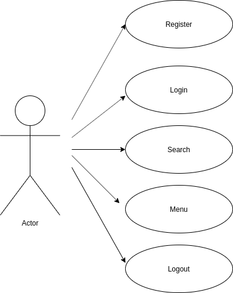

### Flows

- General Flow Chart 

    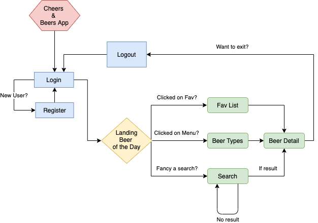

- Activity Flows

    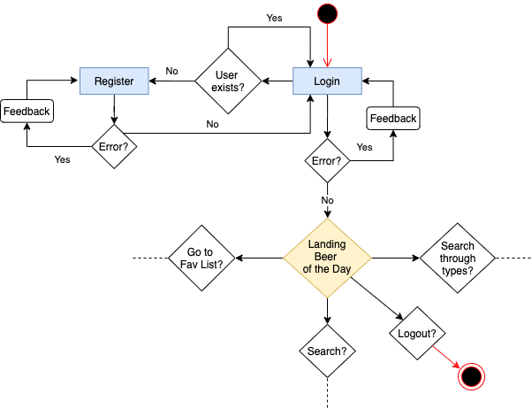
    
    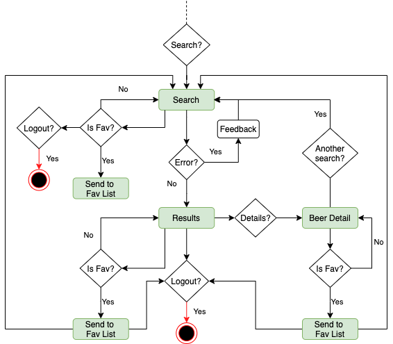
    
    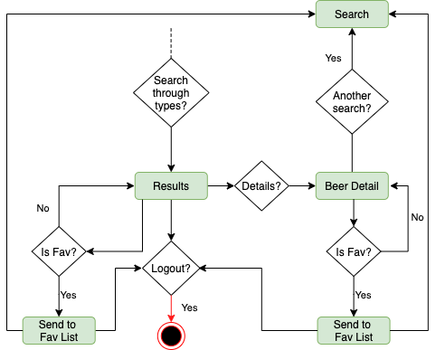
    
    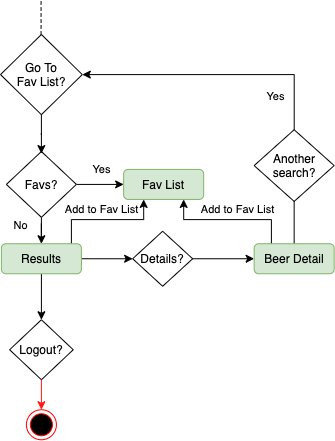

## TECHNICAL DESCRIPTION

### Blocks

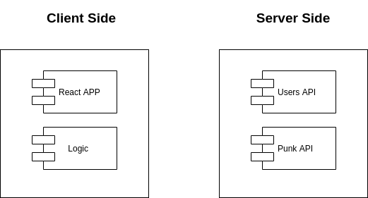

### Modules

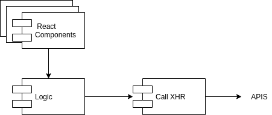

### Sequences

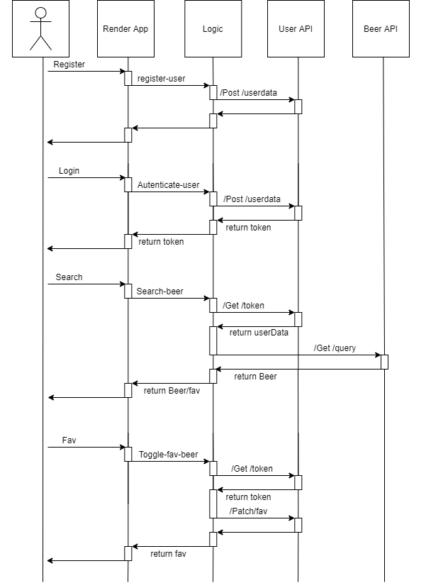

### Classes

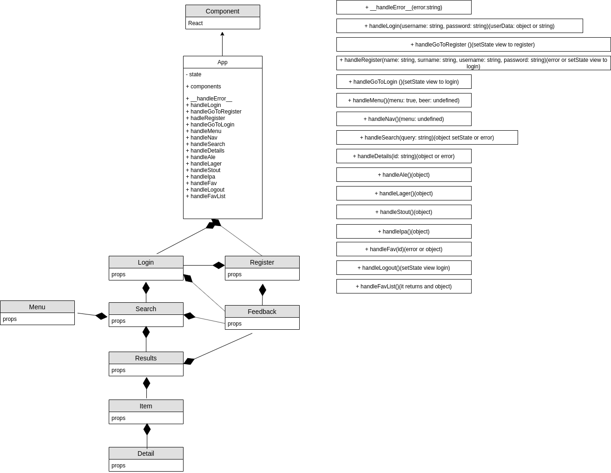

### Data Model

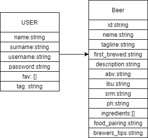