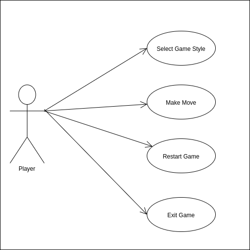
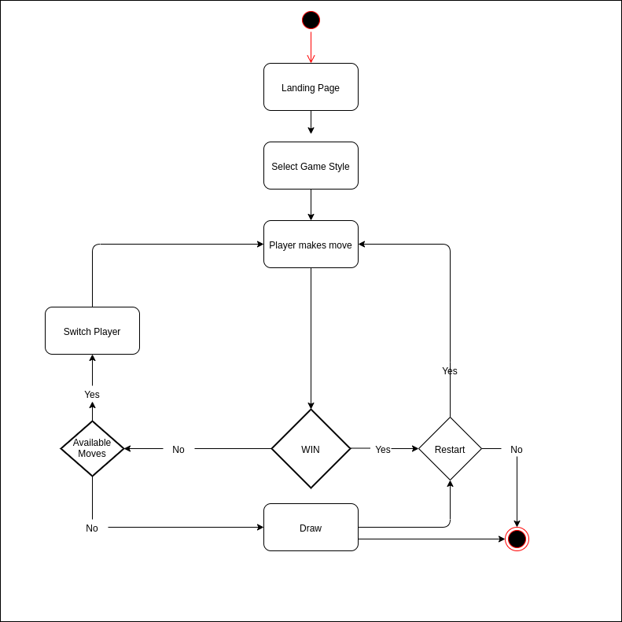
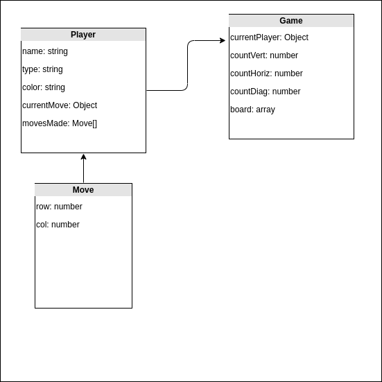

# Connect-4

## Introduction

Simple connect 4 game. You can play against another player or againts the PC.

In order to win you need to place 4 chips of your color in a row. This can be horizontally, vertically or diagonally.

## Functional Description

This game was intended to be created with OOP in mind as much as possible.
The main objects, which are creted through factory functions, are:

1. Game
2. Move
3. Player

The flow of the game is dictated by player making a move which triggers the functions that will check if it is a winning move.
Depending on the result of this functions the Objects will be updated accordingly in order to for the state of the game to be constantly updated.

The user can restart the game at any time, and quit and choose a different game style.

### Use Cases

### Flow

## Technical Description

### Blocks

### Components

### Data Model

