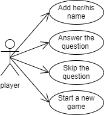
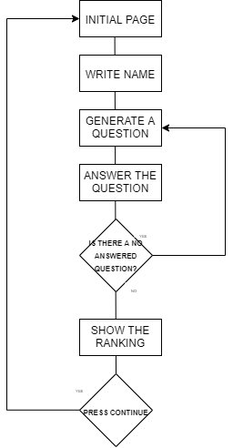
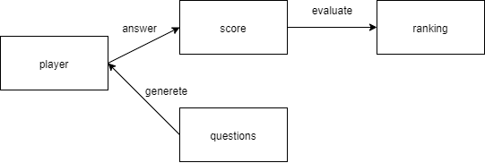
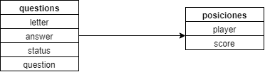

# Introduction
This app imitate the game of "pasapalabra". The player have to answer a question for each letter of the alphabet, generating a score and, after that, see this on a ranking.

### Use Cases


## Technical Description
### Blocks

### Components

### Data Model

```