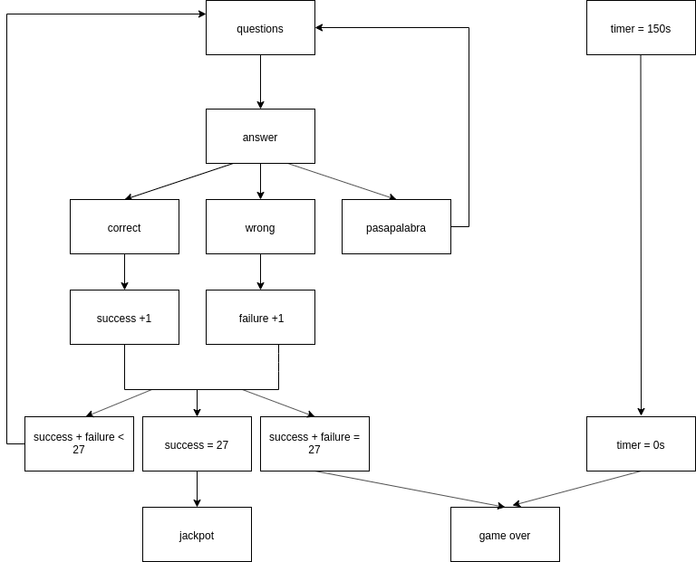
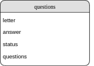

## Introduction

**The Pasapalabra** game made with CSS, HTML and JS in the Skylabcoders pre-course, based on the programm television.

## Functional Description
A question is thrown for each letter of the alphabet, if the player's answer is correct the letter changes to green, if the answer entered is incorrect, the letter changes to red.

If you are not sure of the answer, you can push 'pasapalabra' and that letter remains pending for the next round.

To win the jackpot, all questions must be answered correctly before time runs out.

## Use Cases

## Technical Description

### Blocks

### Data Model
