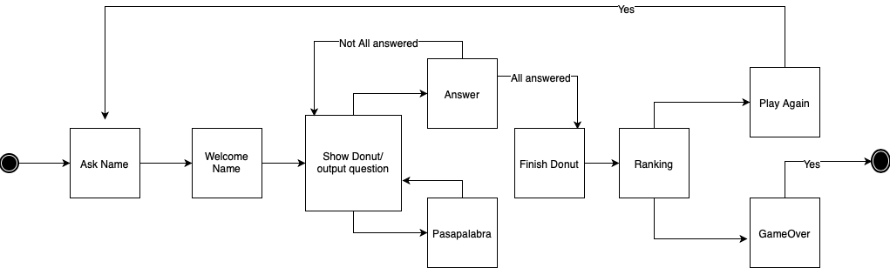

## Introduction:
 The "Pasapalabra" game consists of a series of questions that the player must answer. The game ends by completing the entire series of questions. You have a time limit to answer and a final ranking to write down your successes.
## Funtional Description:
The user and the program develop a simple and direct interaction. The program will launch outputs that the user must convert into inputs to follow the logic of the game.
### Use Cases

## Technical Description:

### Block:

### Components:

### Data Model:
