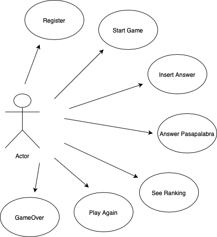
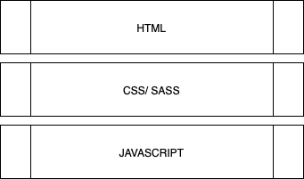
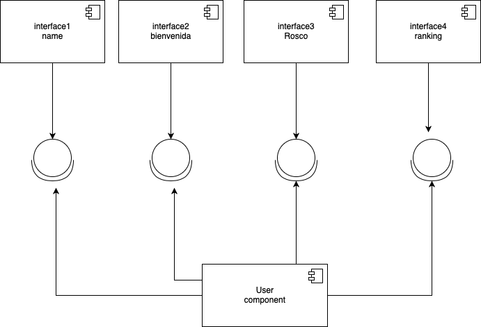

## Introduction:
 The "Pasapalabra" game consists of a series of questions that the player must answer. The game ends by completing the entire series of questions. You have a time limit to answer and a final ranking to write down your successes.
## Funtional Description:

### Use Cases

## Technical Description:

### Block:

### Components:

### Data Model:
