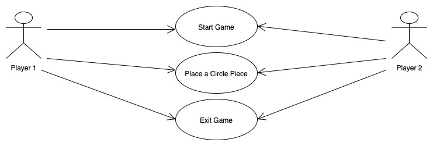
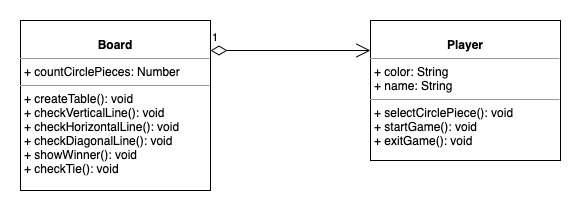
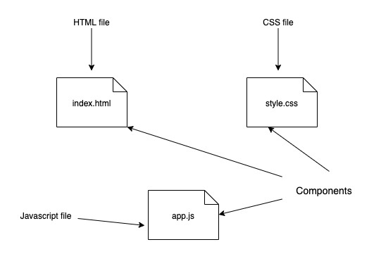
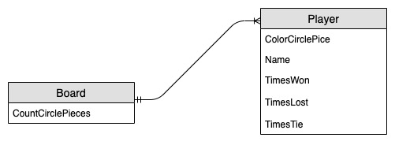

# Connect 4

## Introduction

Connect four is a two player game. The first player choose a color and the second player use the other color. The game is about to make a line of 4 circle pieces either verticale line, horizontal line or digonal line.

## Functional Description

### Use Cases

## Technical Description

### Blocks

### Components

### Data Model
